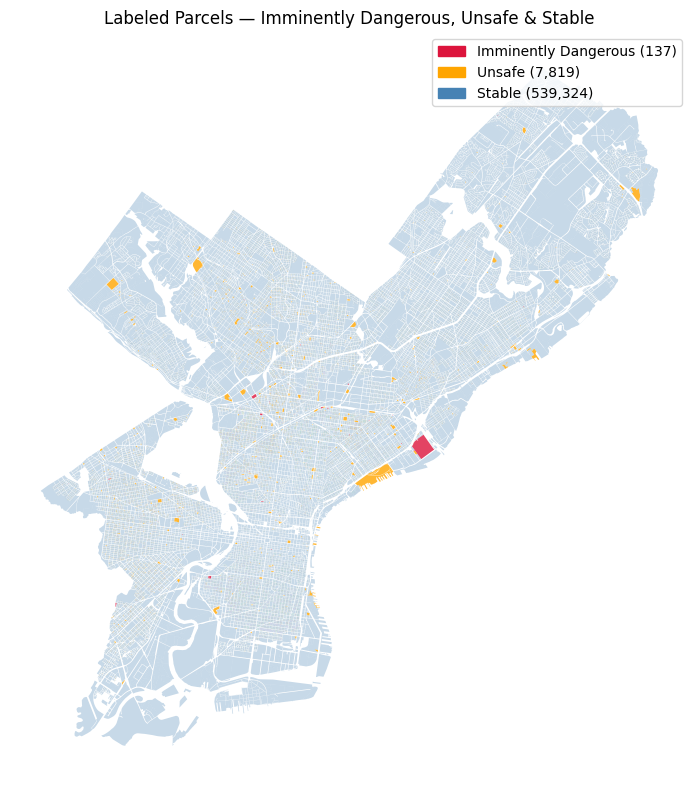
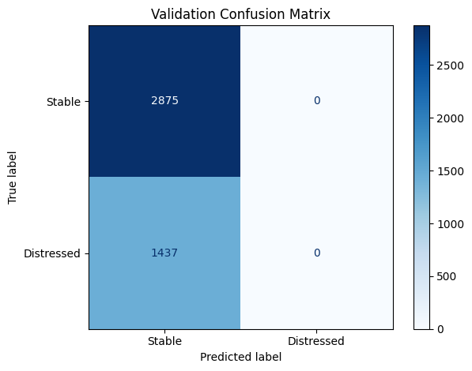
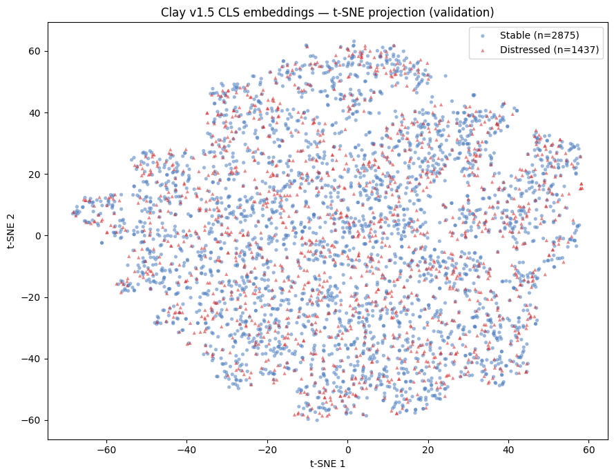
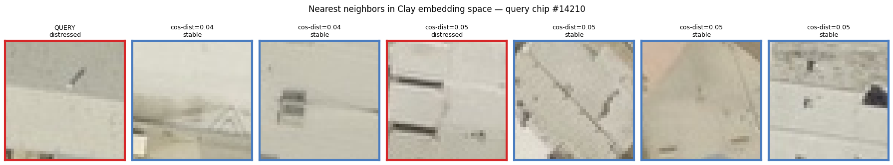
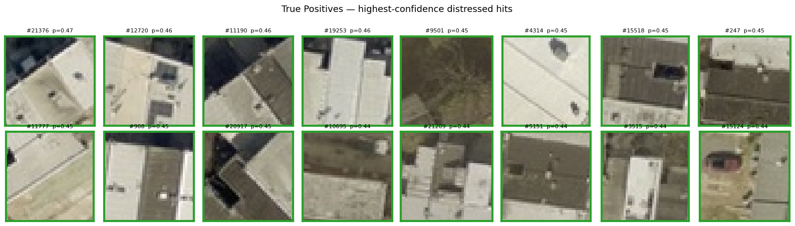
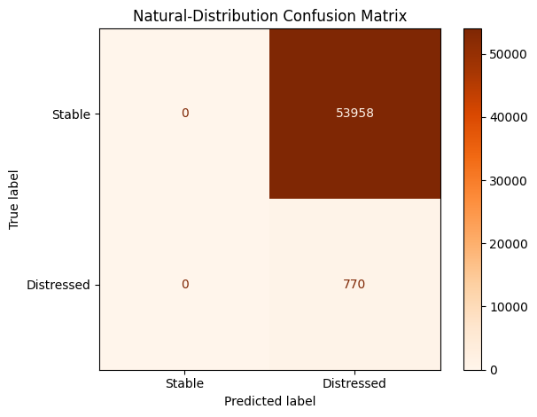
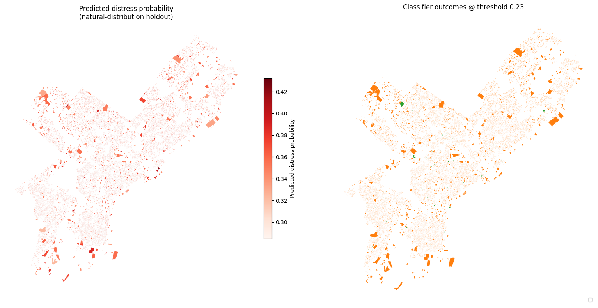

# Detecting Structural Distress at Scale: A Geospatial Foundation Model Approach to Urban Building Safety

**Course:** MUSA 6500: Geospatial Machine Learning in Remote Sensing
**Instructors:** Nissim Lebovits, Guray Erus
**Authors:** Jason Fan, Henry Sywulak-Herr

---

## 1. Problem Definition & Use Case

Philadelphia's aging row home stock presents a unique structural challenge: a single neglected roof can compromise the stability of an entire block. With over 40,000 vacant lots, buildings classified as Imminently Dangerous (ID) within the Philadelphia Property Maintenance Code represent the most severe category of code violation, where a structure is at "imminent danger of failure or collapse."

While the Department of Licenses and Inspections (L&I) maintains a database of vacant property violations — including the Vacant Property Indicator (VPI), which has recently resumed operations after an extended hiatus, though data quality remains inconsistent — administrative data is often reactive and lagged. Mayor Cherelle Parker's administration has also indefinitely paused systematic data collection on vacant lots, leaving gaps in real-time intelligence on structures that pose the greatest immediate threat to Philadelphia residents.

The target user for this project is L&I's Emergency Services Unit and the Philadelphia Land Bank, though it would be broadly useful to most infrastructure- and service-related organizations in Philadelphia (PECO, USPS, Philadelphia Water Department, Planning Office, etc.) that require accurate accounting of vacant parcels. These users need a tool that moves beyond static tax records to identify physical signatures of structural failure — roof collapses, bowing walls, or missing structural members. The intended output is a parcel-level distress score that helps target users identify prime candidates for inspection, acquisition, and stabilization before they cause irreparable injury to residents or adjacent structures.

---

## 2. Data

- **Primary Imagery:** City of Philadelphia Aerial Imagery (0.25 ft / 7.62 cm RGB, latest 2024/2025 mosaic). Ultra-high resolution is essential for identifying precise details of the built environment.
- **Building Footprints / Parcels:** VIDA Open Buildings supplemented by Philadelphia Water Department (PWD) parcel geometries, used for spatial joins and chip extraction.
- **Labels:** L&I Licenses & Inspections violations, reduced to three classes — Imminently Dangerous (ID), Unsafe, and Stable. Unsafe and ID parcels are merged into a single "Distressed" class for training.
- **Permits:** eCLIPSE permit data, used downstream to suppress false positives on parcels with active construction/reconstruction.

The resulting label distribution is severely imbalanced: ~1.4% of parcels carry any distress label, and genuinely Imminently Dangerous parcels make up fewer than 0.03% of the city.

---

## 3. Methodology

### 3.1 Pivot from Clay+UNet segmentation to Clay+RandomForest classification

The project proposal targeted pixel-level damage segmentation using Clay embeddings fed into a UNet decoder. During implementation we pivoted to the approach documented in Clay's official [downstream-classification tutorial](https://clay-foundation.github.io/model/finetune/finetune-on-embeddings.html): run Clay as a frozen feature extractor, cache CLS-token embeddings per chip, and train a classical classifier on top. This change was driven by three considerations:

- Our available labels are parcel-level administrative classifications, not pixel-accurate damage masks, so a segmentation loss has nothing to supervise.
- Clay's documented use pattern for classification is frozen features plus a scikit-learn head — not gradient-based fine-tuning. The tutorial achieves 90% accuracy on marina detection with 216 samples and no training loop.
- Compute cost drops from hours on an A100 to minutes, which let us iterate on the pipeline.

### 3.2 Pipeline

1. **Chipping.** For each parcel centroid, extract a fixed 130 ft (~40 m) window from the Philadelphia aerial mosaic. Pad to square and resize to 256×256, Clay's native pretraining resolution.
2. **Normalization.** Apply Clay's LINZ-aligned band statistics, the closest pretraining platform to 0.3 m RGB aerial imagery.
3. **Embedding extraction.** Run Clay v1.5 large (frozen) and keep the 1024-dim CLS token per chip. Time and latitude/longitude conditioning are set to zero, a configuration sanctioned by the Clay documentation.
4. **Classification.** Train `sklearn.ensemble.RandomForestClassifier` with 500 trees, `class_weight='balanced'`, and `min_samples_leaf=2` on the cached embeddings.
5. **Threshold tuning.** Scan thresholds on the held-out validation set and select the F1-maximizing value.
6. **Permit filter.** At inference time, parcels with active eCLIPSE permits are forced to the Stable class to suppress new-construction false positives.

### 3.3 Train / evaluation split

- **Natural-distribution holdout** — a 10% random sample of all parcels (~54,700 parcels), which retains the true ~1.4% Distressed prior. Never seen during training or threshold tuning.
- **Balanced training pool** — from the remaining 90%, every Distressed parcel plus 2× as many randomly sampled Stable parcels, yielding ~21,600 parcels with a 2:1 class ratio.
- **Train / val split** — 80/20 stratified split of the balanced pool (train ≈ 17,300; val ≈ 4,300).

This two-track evaluation lets us report both in-distribution performance (balanced val) and operationally realistic performance (natural-distribution holdout).

---

## 4. Results

### 4.1 Balanced-validation performance

At RandomForest's default 0.5 probability cutoff, no validation parcel crosses the Distressed threshold:

All 2,875 Stable parcels are correctly classified, but all 1,437 Distressed parcels are predicted Stable. Distressed-class recall is 0 at the default threshold. The F1-optimal threshold on the validation set drops to ≈ 0.23, which raises recall but at the cost of flooding the positive class.

### 4.2 Embedding-space geometry

A t-SNE projection of the 1024-dim Clay CLS embeddings on the validation set makes the underlying issue visible:

Stable (blue) and Distressed (red) points are uniformly intermixed — there is no region of embedding space where one class dominates. The classifier has nothing clean to lean on.

Cosine nearest-neighbor retrieval tells the same story. Pulling the seven closest chips to a known Distressed query returns mostly Stable chips at very small cosine distances (0.04–0.05):

Clay's CLS token is clearly clustering by surface texture (roof tone, orientation, sunlight angle) rather than by the structural-failure signals we care about.

### 4.3 High-confidence true positives

Looking at the top-scoring correctly-flagged Distressed chips from the balanced validation set:

The highest predicted probabilities sit around p = 0.44–0.47 (not far above the 0.23 tuned threshold), and the chips themselves are a mix: some show visible roof patches or debris, but many are ordinary row house roofs whose only distinguishing feature seems to be shadow orientation. The model does not appear to have learned a specific structural-failure concept.

### 4.4 Natural-distribution holdout

At the F1-tuned threshold of 0.23, the classifier collapses when applied to the realistic class distribution:

| Metric | Value |
|---|---|
| n (parcels) | 54,728 |
| True prior (Distressed) | 1.4% (770 parcels) |
| Predicted positive rate | 100% |
| Recall (Distressed) | 1.00 |
| Precision (Distressed) | 0.014 |

Every parcel gets flagged. Mapping the predicted probabilities geographically explains why:

The predicted probabilities for the entire city cluster in a narrow band of roughly 0.28–0.43. There is no clean separation — pushing the threshold up flags nobody, pushing it down flags everybody. The classifier is operating in a regime where almost all signal is noise.

---

## 5. Discussion

The pipeline runs end to end and is reproducible, but it does not produce an operationally useful distress classifier. Three factors explain the negative result.

### 5.1 Clay's global embeddings are the wrong granularity for this task

The CLS token is a 1024-dim summary of the entire 40 m chip. Imminent Dangerousness, when it is visible at all from above, is usually a localized 5% of the pixels — a hole in a roof, a missing chimney, a tarp. Summarizing the whole chip averages that signal away. A segmentation or patch-level approach using Clay's intermediate patch tokens would be a better fit, but requires pixel-level labels we do not have.

### 5.2 Label noise in L&I administrative classifications

L&I's Imminently Dangerous and Unsafe designations are generated by inspection triggers (complaints, prior violations, permit activity), not by physical inspection of every building in the city. Many Unsafe parcels look unremarkable from above because the violation is interior, structural, or on the facade only. Conversely, visibly collapsed buildings are often absent from the Distressed set because no one has yet filed a complaint. Training a visual classifier against a label column that is only partially aligned with visual damage puts a low ceiling on achievable accuracy.

### 5.3 Single timepoint, no elevation

The proposal included two signals that did not make it into this iteration: year-over-year change detection between the 2024 and 2025 mosaics, and DEM- or LiDAR-derived height deltas. Both would directly target the physical failure modes (roof collapse, wall displacement) that pure single-timepoint RGB misses.

---

## 6. What we would try next

- **Patch-token segmentation head.** Replace the CLS RandomForest with a lightweight decoder over Clay's patch tokens, supervised against synthetic pseudo-labels (dark pixels within building footprint, footprint-to-roof-area mismatch). This lets the model focus on local distress rather than global texture.
- **DEM height deltas.** Subtract the 2024 and 2025 elevation surfaces to flag roof collapses directly. This signal is complementary to RGB and robust to shadow and roof-color confounds.
- **Street-level pairing.** Pair each parcel with the nearest Mapillary or Google Street View image. Facade damage — the dominant mode of "Unsafe" — is almost entirely invisible from directly above.
- **Label cleanup.** Manually re-label a stratified subset of Imminently Dangerous parcels against the aerial imagery so we can separate administrative label noise from genuine aerial-visible damage, and evaluate the model on the clean subset.

---

## 7. Comparison of considered approaches

| Approach | Pro | Con | Status |
|---|---|---|---|
| NDVI baseline | Finds "green" roofs (leaks → moss) | Misses structural failures without vegetation | Not pursued |
| Random Forest on hand-crafted features | Fast; uses height features well | Fails to capture the spatial shape of a collapse | Not pursued |
| Clay + UNet segmentation (original plan) | Pixel-level output; captures local damage | Requires pixel-level labels we don't have | Scoped out after label audit |
| **Clay CLS + RandomForest (implemented)** | Follows Clay's documented classification recipe; trivial to train | Global embedding averages away local damage signal; embedding space does not separate the classes | Implemented in `main_v4.py`; negative result |
| Clay patch-token decoder + pseudo-labels | Uses Clay's spatial features; no hand-labels required | More engineering; pseudo-label quality is the bottleneck | Proposed for next iteration |

---

## 8. References

- Schroer, K., Adhikari, B., & Moise, I. (2025, May 29). *Revolutionizing earth observation with geospatial foundation models on AWS.* AWS Machine Learning Blog.
- Hatić, D., Polushko, V., Rauhut, M., & Hagen, H. (2025). *Post-Disaster Building Damage Assessment: Multi-Class Object Detection vs. Object Localization and Classification.* Remote Sensing, 17(24), 3957.
- Liu, C., Ge, L., & Sepasgozar, S. M. E. (2021). *Post-Disaster Classification of Building Damage Using Transfer Learning.* 2021 IEEE International Geoscience and Remote Sensing Symposium IGARSS, Brussels, Belgium, 2194–2197.
- Ahmadi, S. A., Mohammadzadeh, A., Yokoya, N., & Ghorbanian, A. (2024). *BD-SKUNet: Selective-Kernel UNets for Building Damage Assessment in High-Resolution Satellite Images.* Remote Sensing, 16(1), 182.
- Clay Foundation. *Finetune on Embeddings.* https://clay-foundation.github.io/model/finetune/finetune-on-embeddings.html
